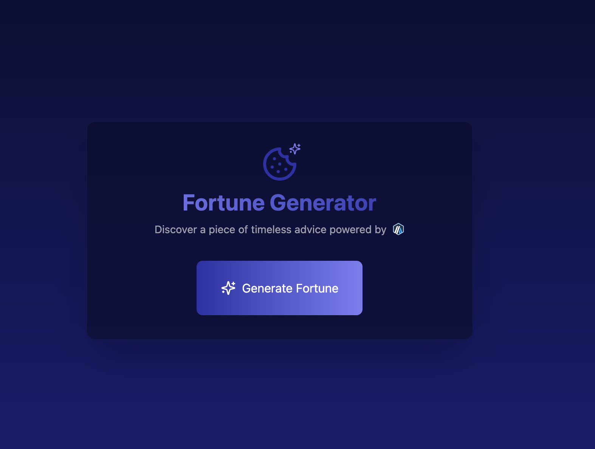

# Fortune Generator on Arbitrum

This is an example of building a full-stack dApp on Arbitrum using [Arbitrum Stylus](https://docs.arbitrum.io/stylus/reference/overview) to write the smart contract in Rust and [ethers.js](https://docs.ethers.io) to interact with the contract from the React + Vite frontend.

<p align="center">
    
</p>

The dApp consists of a smart contract that stores a reference to a fortune string and allows users to set and get the fortune, and a frontend that allows users to interact with the contract by fetching a random fortune.

## Getting Started

### Prerequisites

You need to have the following installed locally:

- [Rust toolchain](https://www.rust-lang.org/tools/install)
- [cargo stylus](https://github.com/OffchainLabs/cargo-stylus)
- [npm](https://www.npmjs.com/get-npm)
- [Docker](https://www.docker.com/products/docker-desktop)
- [Foundry CLI](https://getfoundry.sh/)
- [Nitro Devnode](https://docs.arbitrum.io/run-arbitrum-node/run-nitro-dev-node)

### Running the dApp

#### Smart Contract + Devnode

The frontend is currently written to interact with the smart contract deployed on Nitro devnode, which is a locally run Arbitrum testnet that comes with a pre-funded wallet address available for testing and experimentation. In order to deploy and interact with the smart contract you need to have the Nitro devnode running.

Follow the instructions in the [Nitro Devnode documentation](https://docs.arbitrum.io/run-arbitrum-node/run-nitro-dev-node) to start the Nitro devnode.

Once the devnode is up and running continue with the following steps:

1. Deploy the contract

You will be using the pre-funded wallet address to deploy the contract and can simply copy and paste the following command to do so, assuming you have already installed `cargo stylus`:

```bash
cargo stylus deploy \
  --endpoint='http://localhost:8547' \
  --private-key="0xb6b15c8cb491557369f3c7d2c287b053eb229daa9c22138887752191c9520659"
```

Make sure to copy and store the address of the contract deployed on the devnode as you will add it shortly to the frontend. The output from the above command will return something like this:

```bash
deployed code at address: 0x33f54de59419570a9442e788f5dd5cf635b3c7ac
```

The address `0x33f54de59419570a9442e788f5dd5cf635b3c7ac` is the address of the deployed contract in this example.

2. Generate fortune references on chain

Now that your contract is deployed, you need to create some references stored on chain to fortune strings that the frontend will fetch when a user clicks the "Get Fortune" button. You can do this by running the following command, make sure you have the [Foundry CLI](https://getfoundry.sh/) installed:

```bash
cast send --rpc-url 'http://localhost:8547' \
  --private-key 0xb6b15c8cb491557369f3c7d2c287b053eb229daa9c22138887752191c9520659 \
  [deployed-contract-address] "mintFortune(uint32)" 45
```

Replace `[deployed-contract-address]` with the address of the contract you deployed in the previous step, also removing the square brackets. This command will generate a fortune reference at index 45. 

Run this command several times changing the index to generate more fortune references.

When you are done you can check to see how many fortune references have been generated by running the following command:

```bash
cast call --rpc-url 'http://localhost:8547' \
  [deployed-contract-address] "totalMintedValue()"
```

Remember to replace `[deployed-contract-address]` with the address of the contract you deployed in the previous step.

#### Frontend

Now that the contract is deployed and you have generated some fortune references on chain, you can run the frontend to interact with the contract.

1. Start the frontend dev server

Navigate to the `fortune-frontend` directory and run the following commands:

```bash
npm install
npm run dev
```

This will install the dependencies and start the frontend dev server. You can now navigate to `http://localhost:5173` in your browser to interact with the dApp.

2. Add the contract address to the frontend

You are not quite done yet, you need to add the address of the deployed contract to the frontend. Open the `fortune-frontend/src/App.tsx` file and replace the value of the `contractAddress` with the address of the contract you deployed on the Nitro devnode.

```typescript
const contractAddress = 'your-contract-address';
```

The frontend will automatically update itself when you save the file, you do not need to restart the server.

3. Interact with the dApp

You can now interact with the dApp by clicking the "Generate Fortune" button to fetch a random fortune from the contract. The fortune will be displayed on the screen.

## License

This project is licensed under the [MIT License](LICENSE).